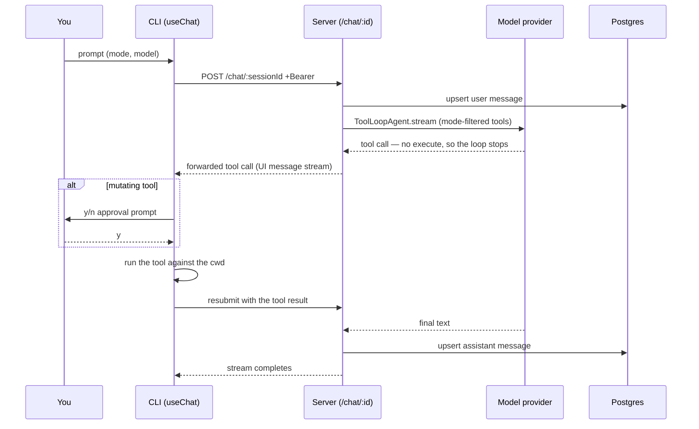

# nightcode

A terminal coding agent. `nightcode` runs in your terminal, talks to a hosted
server, and reads and edits files in whatever project you launch it from.

The split is deliberate: **the server decides, the CLI acts.** Model calls and
conversation storage live on a hosted Hono server; every tool call — reading a
file, running a command — is forwarded back to your machine and executed there.
The server never touches a filesystem, and your code never leaves your box except
as the context you choose to send.

```
┌─ your terminal ─────────────┐        ┌─ hosted server ─────────────┐
│  OpenTUI CLI                │  HTTPS │  Hono + AI SDK              │
│  · renders the chat         │ <────> │  · runs the agent loop      │
│  · executes tool calls      │        │  · owns the model API keys  │
│  · gates writes on approval │        │  · persists the transcript  │
└─────────────────────────────┘        └─────────────────────────────┘
         ↕ your project files                     ↕ Postgres (Prisma)
```

---

## Contents

- [Install](#install) · [Using nightcode](#using-nightcode)
- [How it works](#how-it-works) — [request lifecycle](#the-request-lifecycle), [tool execution](#why-tools-run-on-the-client), [safety](#the-workspace-boundary), [auth](#authentication)
- [Repository layout](#repository-layout) · [Development](#development) · [Extending](#extending-the-app)
- [Deploying the server](#deploying-the-server) · [Cutting a CLI release](#cutting-a-cli-release)
- [Troubleshooting](#troubleshooting)

---

## Install

Requires [Bun](https://bun.com) v1.2+. This is not optional — the launcher's
shebang is `#!/usr/bin/env bun`, the bundle is built `--target bun`, and
`@opentui/core` `dlopen`s a native library through `bun:ffi`. It cannot run under
Node.

```bash
curl -fsSL https://raw.githubusercontent.com/Alexandra2888/nightcode/master/install.sh | sh
```

That downloads the latest release, installs its dependencies, and links
`nightcode` into `~/.local/bin`. The server URL and sign-in config are baked into
the build, so there is nothing to configure.

```bash
cd ~/some/project
nightcode          # then /login to sign in
```

**The directory you launch from is the workspace.** Every file tool is confined
to it, and `bash` runs with it as cwd. Launch from the project root you want the
agent to work in.

| Variable            | Effect                                                          |
| ------------------- | --------------------------------------------------------------- |
| `NIGHTCODE_HOME`    | Install prefix (default `~/.local/lib/nightcode`)                |
| `NIGHTCODE_BIN_DIR` | Where the launcher is linked (default `~/.local/bin`)            |
| `SERVER_URL`        | Point one run at a different server — beats the baked-in value   |

```bash
SERVER_URL=http://localhost:3001 nightcode     # talk to a local dev server
```

To uninstall: `rm -rf ~/.local/lib/nightcode ~/.local/bin/nightcode`. User state
lives in `~/.config/nightcode/` (session tokens + theme) and is left alone.

---

## Using nightcode

### The two screens

**Home** is a banner, a sign-in indicator, and a prompt box. Typing a prompt and
pressing Enter creates a session server-side, then navigates into it — so the
session id exists before the first message is ever sent.

**Chat** is the transcript, a reply box, and an inline status line. Tool calls
render as they run; mutating ones pause for a y/n decision.

### Keys

| Key                | Does                                                                     |
| ------------------ | ------------------------------------------------------------------------ |
| `Enter`            | Send the message (or accept the highlighted popover item)                |
| `Shift+Enter`      | Newline¹                                                                 |
| `Tab` / `Shift+Tab`| Cycle the behaviour mode forward / backward                              |
| `@`                | Open the file-mention popover — inlines the file's contents              |
| `/`                | Open the slash-command palette                                           |
| `y` / `n`          | Approve / deny a pending tool call                                       |
| `Esc`              | Close the topmost popover or dialog → go back → quit                     |
| `Ctrl+C`           | Same escalation, routed explicitly through the layer stack               |

¹ Shift+Enter is only distinguishable from Enter in terminals speaking the
enhanced/kitty keyboard protocol (Ghostty, Kitty, WezTerm, recent iTerm2). In a
basic terminal both send the same bytes, so Shift+Enter submits too.

### Slash commands

Typed as the entire buffer — `/new` runs the command, `/new thing` sends a
message. Exact-match on purpose, so the literal text stays sendable.

| Command     | Does                                        |
| ----------- | ------------------------------------------- |
| `/new`      | Start a new session (back to home)          |
| `/sessions` | Searchable list of your past sessions       |
| `/model`    | Pick the model this session runs on         |
| `/theme`    | Pick a color theme (persisted)              |
| `/login`    | Browser OAuth sign-in                       |
| `/logout`   | Revoke the token and clear local credentials|
| `/exit`     | Quit                                        |

### Modes

A mode pairs a system prompt with a **tool allow-list**, and the allow-list is
what actually enforces it — a plan-mode agent is never given the mutating tools,
so it cannot emit a call for one. Modes are toggled with Tab, mid-session, and
the mode each turn ran in is stored on the message row (it colors the message's
left bar, and survives a reload).

| Mode      | Tools                                                       | Approval        |
| --------- | ----------------------------------------------------------- | --------------- |
| **Plan**  | `read_file`, `list_directory`, `grep`                        | none needed     |
| **Build** | all six, adding `write_file`, `edit_file`, `bash`            | y/n per mutation|

Plan is the default — a fresh session opens read-only.

### Models

Picked per session via `/model`. The registry (`packages/ai/src/models.ts`)
carries per-model provider options, because model capabilities genuinely differ:

| Id                 | Provider  | Reasoning config                              |
| ------------------ | --------- | --------------------------------------------- |
| `claude-haiku-4-5` | Anthropic | `thinking: { type: "enabled", budgetTokens: 1024 }` (default) |
| `claude-sonnet-5`  | Anthropic | `thinking: { type: "adaptive" }`, `effort: "medium"` |
| `gpt-5.1`          | OpenAI    | none — reasoning off deliberately             |

Haiku rejects `adaptive`; Sonnet 5 rejects `enabled`. That's why the options live
per model rather than per provider.

### Tools

| Tool             | Approval | Notes                                                        |
| ---------------- | -------- | ------------------------------------------------------------ |
| `read_file`      | —        | UTF-8 contents of one file                                    |
| `list_directory` | —        | Directory entries                                             |
| `grep`           | —        | Regex over file contents; returns file + line + text          |
| `write_file`     | **y/n**  | Create or overwrite                                           |
| `edit_file`      | **y/n**  | Exact-substring replace; fails if missing or ambiguous        |
| `bash`           | **y/n**  | `bash -lc`, cwd = workspace, 2 min timeout, output capped 30 KB |

`edit_file` refusing an ambiguous match is the point — an edit can never silently
land on the wrong occurrence.

### `@` file mentions

Typing `@` opens a substring-filtered picker over the workspace (capped at 500
files, skipping
`.git`, `node_modules`, `.next`, `.turbo`, `coverage`, `dist`). The picked file's
contents are attached to the message as an inline
`<file path="src/foo.ts">…</file>` part, so the agent reads it without spending a
`read_file` round-trip. The visible text keeps the `@path` you typed.

---

## How it works

### The request lifecycle



The resubmit is declarative: `sendAutomaticallyWhen:
lastAssistantMessageIsCompleteWithToolCalls` fires as soon as every tool call in
the last assistant turn has a result. The agent loop is capped at
`stepCountIs(20)` with `maxOutputTokens: 4096`.

### Why tools run on the client

The agent's tools are defined **without an `execute` function**. That is not an
oversight — it's the mechanism. An execute-less tool makes the SDK's loop halt at
the call and hand it to the caller, so the server (which has no filesystem, and
no business having one) forwards it down the stream and the CLI runs it against
your working directory.

Two consequences fall out of that:

- **Approval is a client concern.** The SDK's server-side `toolApproval` exists
  for server-*executed* tools: approve → the server runs `execute` → emits a
  `tool_result`. With no `execute`, an approval would re-call the model with a
  `tool_use` and no matching `tool_result`, which Anthropic rejects outright. So
  the CLI simply withholds the result until you press `y`, then returns a normal
  result down the same path the read-only tools use.
- **Two tool sets, two jobs.** The incoming message *history* is validated and
  converted against the **full** tool set, while the active turn runs on the
  mode's **filtered** set. Modes toggle mid-session, so a transcript recorded in
  build mode legitimately contains `write_file` parts that a plan-mode agent's
  tool set wouldn't recognise — validating history against the subset would 400 a
  perfectly good request.

### One type map drives everything

`packages/ai/src/types.ts` hand-declares `ToolInputs` / `ToolOutputs`. It's the
master key list, written out by hand rather than derived, precisely so a
half-wired tool can't slip through — a derived map would silently grow and
suppress the errors you want. Every other registry conforms to it via `satisfies`:

```
types.ts  ──────────────►  ToolName union
   │
   ├─► tools/schemas.ts    satisfies Record<ToolName, …>   (Zod, shared)
   ├─► tools/runners.ts    satisfies { [K in ToolName]: … } (Node-only, CLI)
   ├─► tools/toolset.ts    satisfies Record<ToolName, Tool> (AI SDK, server)
   └─► client.ts switch    default: never                   (exhaustive dispatch)
                                │
                                └─► CodingAgentUIMessage ──► useChat<…>
```

The last link is what makes it worth the ceremony: `onToolCall`'s
`toolCall.toolName` is the `ToolName` union with per-tool typed inputs and
outputs, not `string`/`unknown`, and `addToolOutput` is checked against that
tool's output schema. Forget any one registry and it fails to compile.

The same `as const satisfies` registry shape is reused for
[modes](packages/ai/src/modes.ts) and [models](packages/ai/src/models.ts) — array
of literals → derived id union → lookup helpers with a first-element fallback,
plus a `z.enum` over the ids so the server rejects an unknown value at validation
rather than deep inside a handler.

### The workspace boundary

Every file tool resolves its path through `resolveWithinWorkspace`
([`packages/ai/src/workspace.ts`](packages/ai/src/workspace.ts)), which refuses
anything escaping the launch directory. Two layers, because one isn't enough:

1. **Lexical** — `path.resolve` against the workspace, then require the result to
   be the workspace or sit under `workspace + sep`. Kills `../../etc/passwd` and
   absolute outside paths.
2. **Symlink** — `path.resolve` is purely lexical, so a symlink *inside* the
   workspace pointing out of it would sail through layer 1. The real path of the
   nearest existing ancestor is re-checked (the target itself may not exist yet
   for a write).

`bash` is deliberately **not** routed through this. A shell command cannot be
confined to a directory — it can `cd`, read absolute paths, and reach the
network. It runs with the workspace as cwd and is gated behind your explicit
approval instead. That's the honest trade, stated rather than papered over.

### Authentication

Clerk acting as the OAuth provider, Authorization Code + PKCE, **public client**
(no secret — the client id plus the PKCE verifier are the whole authentication).
All the mechanics are `oauth4webapi`'s; none of it is hand-rolled.

- `/login` discovers the AS metadata, opens the browser, and captures the
  redirect on a **pinned** loopback: `http://localhost:8976/callback`. Pinned
  because the redirect URI has to be registered verbatim in Clerk — a random
  per-login port gives Clerk nothing to whitelist. A retried `/login` cancels the
  previous listener rather than colliding on the port.
- Scopes are `openid profile email offline_access`. The refresh token matters: a
  long agent run must not get logged out mid-prompt.
- Tokens land in `~/.config/nightcode/auth.json` (dir `0700`, file `0600`,
  `chmod`'d unconditionally since `writeFile`'s mode only applies on create). The
  file is untyped JSON on disk, so it's Zod-validated on every read.
- Access tokens refresh **60 s before** expiry, and concurrent refreshes collapse
  onto a single exchange.
- `/logout` revokes server-side first, then clears locally — and clears even if
  revocation fails, since a network error must never leave credentials on disk.

Server-side, `authMiddleware` verifies the bearer with Clerk's backend SDK and
puts the resolved `userId` on `c.var.auth`. Both Clerk keys are read **at import
time**, so a missing or empty one crash-loops the process with a named variable
rather than serving cryptic 500s.

### Endpoints

| Method | Path                     | Auth | Response                              |
| ------ | ------------------------ | ---- | ------------------------------------- |
| GET    | `/health`                | no   | `{ status, uptime }`                  |
| POST   | `/sessions`              | yes  | `201 { id }` — title = first prompt line |
| GET    | `/sessions`              | yes  | your sessions, newest-updated first   |
| GET    | `/sessions/:id/messages` | yes  | the transcript, for hydration         |
| POST   | `/chat/:sessionId`       | yes  | streaming agent response              |

Everything but `/health` requires a Clerk OAuth bearer, so an unauthenticated
request — **including one to `/`** — gets a `401`. That's the middleware working,
not an outage. `/health` is registered *before* the middleware precisely so a
platform health probe can reach it.

Ownership is enforced in the query, not after it: session lookups use `findFirst`
with `userId` in the `where`, so another user's session id reads as `404` and
never leaks its existence.

The CLI reaches these through a **typed Hono RPC client**
([`apps/cli/src/lib/client.ts`](apps/cli/src/lib/client.ts)) built over the
server's exported `AppType` — adding or removing a server field surfaces as a CLI
type error. The one exception is the chat stream, which `useChat` owns; even
there the URL is derived via `$url()` so reshaping the route is still a compile
error.

### Data model

Two tables. Users live in Clerk, so there is no users table — a session is scoped
by a plain `userId` string.

```
Session                                Message
─────────                              ─────────
id        cuid                         id        String  (the client UIMessage id)
userId    String  @@index              sessionId String  @@index → Session, cascade
title     String?                      role      Role    system|user|assistant
createdAt DateTime                     parts     Json    UIMessage.parts, verbatim
updatedAt DateTime                     metadata  Json?   UIMessage.metadata
messages  Message[]                    mode      Mode    build|plan
                                       createdAt DateTime
```

`parts` and `metadata` are stored **verbatim as JSON**, not normalized, because
the AI SDK owns and evolves that shape — the same reason the request validator
delegates to the SDK's `safeValidateUIMessages` instead of a hand-written Zod
tree. Message ids are reused from the client, so re-writing the same message is
an idempotent upsert rather than a duplicate insert; both the pre-stream user
write and the on-finish assistant write are retry-safe.

The Prisma `Mode` enum is the single source of truth for mode names — the mode
registry types its `name` field as that enum, so renaming a mode in the schema
fails to compile every registry entry.

---

## Repository layout

A Bun-workspaces monorepo. Bun is both the runtime and the package manager.
Workspaces are globbed as `["apps/*", "packages/*"]`, so a new app or shared
package is picked up automatically once its folder exists.

```
nightcode/
├── apps/
│   ├── server/                 Hono HTTP API (runs on Bun)
│   │   └── src/
│   │       ├── app.ts          chained route mounting → exported AppType
│   │       ├── middleware/     Clerk bearer auth
│   │       └── routes/         one folder per group: route.ts + schema.ts + route.test.ts
│   └── cli/                    OpenTUI terminal client
│       ├── scripts/build.ts    bundle + shebang wrapper + release manifest
│       └── src/
│           ├── app.tsx         MemoryRouter shell + always-mounted dialogs
│           ├── screens/        full-screen views
│           ├── components/     chat, dialog, toast building blocks
│           ├── hooks/          popovers, commands, auth status
│           └── lib/            client, auth, theme, layer, file-mentions, env
└── packages/
    ├── ai/                     nightcode-ai — agent, tools, modes, models
    │   └── src/
    │       ├── index.ts        shared entry (Zod-only, safe for both sides)
    │       ├── server.ts       ToolLoopAgent + provider factory (AI SDK)
    │       ├── client.ts       tool execution + approval helpers (Node-only)
    │       ├── <tool>/         schema.ts + runtime.ts, one folder per tool
    │       └── tools/          the three registries
    └── database/               nightcode-database — Prisma client + schema
```

### The three-entry AI package

`nightcode-ai` is split by what each half is allowed to import, which is what
keeps the CLI bundle free of the AI SDK and the server free of `fs`:

| Entry                 | Contains                                              | Imports          |
| --------------------- | ----------------------------------------------------- | ---------------- |
| `nightcode-ai`        | tool schemas, type map, mode + model registries        | Zod only         |
| `nightcode-ai/server` | `createCodingAgent`, tool sets, provider factory       | `ai`, `@ai-sdk/*`|
| `nightcode-ai/client` | tool runners, `handleCodingAgentToolCall`, approvals   | Node `fs`/`spawn`|

### CLI structure notes

- **Routing** is `react-router` core with `MemoryRouter` — a TUI has no DOM or URL
  bar, so `BrowserRouter`, `<Link>`, and `Form` don't apply. Navigation is
  `useNavigate()` bound to keys.
- **Dialogs mount in the layout route, before `<Outlet/>`.** Two reasons: they
  need router context, and OpenTUI's global key handlers fire in registration
  order — a dialog rendered first registers its Escape handler ahead of the
  screen's and can cancel the screen's go-back. They're always mounted (rendering
  only when active) so registration happens at app start; a lazily-mounted dialog
  would lose that race.
- **Ctrl+C is routed through an explicit layer stack**
  ([`lib/layer.tsx`](apps/cli/src/lib/layer.tsx)) rather than registration order.
  A terminal gives you no z-index, so the app builds the equivalent: layers carry
  a `z`, the dispatcher walks them top-down, and the first handler returning
  `true` wins — dialog close beats text clear beats quit. Everything else (Escape,
  Tab, y/n) stays on per-component handlers.
- **Enter precedence is arbitrated by one switch** in `chat-text-area.tsx`:
  file-mention popover → command popover → submit. Any feature that wants Enter
  registers as an ordered branch there.

---

## Development

### Setup

```bash
git clone git@github.com:Alexandra2888/nightcode.git
cd nightcode
bun install                 # postinstall runs `prisma generate`
cp .env.example .env        # then fill it in
bun run db:push             # push the schema to your database
```

Then, in two panes:

```bash
bun run dev:server          # http://localhost:3001
bun run dev:cli
```

The Prisma client is generated by `packages/database`'s `postinstall`, which
fires **only** because `nightcode-database` is listed in the root
`trustedDependencies` — Bun blocks lifecycle scripts by default, workspace
packages included, and it does so silently. The failure mode is a
successful-looking `bun install` followed by unresolvable imports. Both halves are
required; changing either alone is a no-op. Verify with:

```bash
rm -rf packages/database/generated && bun install && ls packages/database/generated
```

### Scripts (run from the repo root)

| Script                 | Description                                       |
| ---------------------- | ------------------------------------------------- |
| `bun install`          | Install all workspace dependencies                |
| `bun run dev:server`   | Hono server, hot reload (default port 3001)       |
| `bun run dev:cli`      | OpenTUI CLI, watch mode                           |
| `bun run start`        | Production server start (no `--env-file`)         |
| `bun run start:server` | Run the server once, loading `.env`               |
| `bun run start:cli`    | Run the CLI once, loading `.env`                  |
| `bun run build`        | Build every workspace                             |
| `bun run build:cli`    | Build the standalone CLI, baking in config        |
| `bun run package:cli`  | Package `dist/` into `nightcode-cli.tgz`          |
| `bun run db:generate`  | Regenerate the Prisma client                      |
| `bun run db:push`      | Push the Prisma schema                            |
| `bun run db:studio`    | Open Prisma Studio                                |
| `bun test`             | Run all tests (154 across 24 files)               |
| `bun run typecheck`    | Type-check all workspaces (`tsc --build`)         |

**Bun does not type-check.** `bun run typecheck` is a separate, mandatory step —
it's the guardrail that catches `satisfies` drift, mis-named OpenTUI props, and
stale types. A task isn't done while it reports errors.

### Environment variables

Copy [`.env.example`](.env.example) — it's annotated. Summary:

| Variable                            | Side   | Notes                                                  |
| ----------------------------------- | ------ | ------------------------------------------------------ |
| `DATABASE_URL`                      | server | Direct `postgres://…` TCP URL, **not** the `prisma+postgres://` Accelerate one |
| `CLERK_SECRET_KEY`                  | server | Secret. Read at import time — missing ⇒ boot crash     |
| `NEXT_PUBLIC_CLERK_PUBLISHABLE_KEY` | server | Same import-time check                                 |
| `ANTHROPIC_API_KEY`                 | server | Not boot-validated — surfaces as a mid-stream 500      |
| `OPENAI_API_KEY`                    | server | Only needed for the `gpt-5.1` registry entry           |
| `PORT`                              | server | Defaults to 3001, dodging a Next.js dev server         |
| `SERVER_URL`                        | CLI    | Protocol included, **no** trailing slash               |
| `CLERK_FRONTEND_API`                | CLI    | Public. With or without protocol                       |
| `CLERK_OAUTH_CLIENT_ID`             | CLI    | Public PKCE client id                                  |
| `XDG_CONFIG_HOME`                   | CLI    | Moves `~/.config/nightcode/`                           |
| `NIGHTCODE_BASH_TIMEOUT_MS`         | CLI    | `bash` tool timeout (default 120000)                   |
| `NIGHTCODE_DEBUG_LOG`               | CLI    | Debug log path (default `/tmp/nightcode-debug.log`)    |

**How the CLI resolves config**, strongest to weakest — the one place this
precedence is expressed is
[`lib/load-root-env.ts`](apps/cli/src/lib/load-root-env.ts); every consumer just
reads `process.env.X`:

1. real shell env / `--env-file`
2. the nearest `.env` walking up from the source (the repo root in dev) — the walk
   **stops before `$HOME`**, so an installed binary under `~/.local/lib` can't be
   hijacked by a stray `~/.env`
3. `~/.config/nightcode/.env` — global user config for a standalone install
4. the values baked into the bundle at build time

### Testing

```bash
bun test                                   # everything
bun test apps/cli/src/components/dialog    # one directory
```

Tests are colocated (`*.test.ts` / `*.test.tsx`). Server route tests hit
`app.request(...)` directly — `app.ts` never binds a port, so importing it is
side-effect-free. TUI tests drive the real OpenTUI parse path.

**Test key sequences with `mockInput.pressKeys([...], delayMs)`.** Calling
`pressArrow()` then `pressEnter()` back-to-back races the stdin parser — the
arrow may not land before Enter resolves. `pressKeys(["ARROW_DOWN","RETURN"], 5)`
delivers each in order.

### Debugging the TUI

OpenTUI owns the whole terminal (alternate screen buffer), so `console.log` is
either swallowed or garbles the render. Use the file logger instead:

```ts
import { debugLog } from "../lib/debug-log.ts";
debugLog("hydrated", { count: hydrated.length });
```

```bash
tail -f /tmp/nightcode-debug.log     # in another pane
```

---

## Extending the app

Each of these is designed so that a half-finished job fails to compile rather
than failing at runtime.

<details>
<summary><b>Add a tool</b></summary>

1. `packages/ai/src/<tool>/schema.ts` — export the schema object (`name`,
   `description`, `inputSchema`, `outputSchema`, `needsApproval`) plus its
   inferred `…Input` / `…Output` types.
2. `packages/ai/src/<tool>/runtime.ts` — the executor. Resolve any path through
   `resolveWithinWorkspace`.
3. Add the key to **both** `ToolInputs` and `ToolOutputs` in `types.ts`.
4. Register it in `tools/schemas.ts`, `tools/runners.ts`, and `tools/toolset.ts`.
5. Add a `case` to the dispatch switch in `client.ts`.
6. Add it to any mode's `tools` allow-list in `modes.ts` that should have it.

Step 3 widens `ToolName`, which turns steps 4–5 into compile errors until done.
</details>

<details>
<summary><b>Add a mode</b></summary>

Append to the `modes` array in `packages/ai/src/modes.ts`, and add the name to
the `Mode` enum in `packages/database/prisma/schema.prisma` (the registry's
`name` is typed as that enum). It joins the Tab cycle, the wire schema, the
`ModeName` union, and the server's lookup automatically. Give it a color in each
theme's `mode` record.
</details>

<details>
<summary><b>Add a model</b></summary>

Append to `codingAgentModels` in `packages/ai/src/models.ts` (one place — it
feeds the `/model` picker, the id union, and the wire schema), then add a `case`
to the provider switch in `models.server.ts`. A new provider needs its SDK
imported there; the `never` fallback fails to compile until you do.
</details>

<details>
<summary><b>Add a server route</b></summary>

Follow the `routes/chat/` template: a folder with `route.ts` (a standalone,
**chained** Hono instance), `schema.ts` (Zod), and `route.test.ts`. Mount it with
another chained `.route("/<group>", …)` in `app.ts`.

Two non-negotiables: keep the chain unbroken (chaining is what keeps `AppType`
inferable for the RPC client), and validate with `zValidator` + `c.req.valid(...)`
rather than hand-parsing `await c.req.json()`.
</details>

<details>
<summary><b>Add a CLI screen or dialog</b></summary>

**Screen**: `screens/<name>-screen.tsx`, a `<Route path=…>` in `app.tsx`, and a
`useNavigate()` call bound to a key. Go back with `navigate(-1)`.

**Dialog**: build on `Dialog` / `SearchListDialog`, give it an id in
`dialog-ids.ts`, mount it in `RouterLayout` **before** `<Outlet/>`, and wire a
slash command to `openDialog(id)`.

**Theme**: a manifest under `lib/theme/`, appended to `THEMES` in `registry.ts`.
The `Theme` type is a fixed shape, so a new theme is a pure values-swap — if it
needs a field the shape lacks, the shape gets a consolidation pass first.
</details>

### Conventions worth knowing

Full contributor guidance is in [`AGENTS.md`](./AGENTS.md) (`CLAUDE.md` is a
symlink to it, so every agent reads the same file). The load-bearing ones:

- **File names are kebab-case**; the exported React identifier stays PascalCase.
- **Screens are not components.** Full-screen views in `screens/`, reusable parts
  in `components/`. `src/` stays uncluttered — only the entry point and the
  router shell sit loose.
- **Parse untyped external input with Zod, never a type-cast.** Router
  `location.state`, env vars, parsed JSON, the auth file, the theme config — all
  of it goes through a schema. `safeParse(...).data ?? fallback` when absence is
  legitimate.
- **`<textarea>` is uncontrolled.** No `value`/`onChange` — read `ref.current
  ?.plainText` on submit.
- **Imperative handlers read a ref, not the state they mirror.** OpenTUI's
  submit/key handlers capture a stale closure; mirror state in a `useRef` and
  read that inside the handler.
- **Colors are hex only.** `rgba(…)` silently falls back to magenta; use 8-digit
  `#rrggbbaa`.
- **No fire-and-forget async IIFEs in effects.** Named async function + a
  `cancelled` flag + a cleanup return.
- **`addToolOutput` is synchronous — never `await` it.**
- **Declare every package you import.** `bunfig.toml` sets `linker = "isolated"`,
  but Bun 1.2.x silently ignores it (the isolated linker landed in 1.3) — so a
  phantom dependency resolves fine locally and fails only on the deploy host with
  `error: Could not resolve: "<pkg>"`. Neither typecheck, tests, nor a local
  build will catch it.
- **Answer OpenTUI questions from the OpenTUI skill**, not `node_modules`.

---

## Deploying the server

Any host that runs Bun works. On Railway:

1. **New project → Deploy from GitHub repo →** this repo → **Deploy Repo**. That
   creates a single service from the repo root, which is what you want: leave
   **Root Directory** at `/`, not `apps/server`. The server depends on
   `nightcode-ai` and `nightcode-database` as `workspace:*`, so the whole
   workspace has to install.
2. The first deploy **fails**, and should — there are no variables yet, and
   `middleware/auth.ts` reads its Clerk keys at import time. Configure, then
   redeploy.
3. **Variables → Raw Editor**: paste the server-side keys from `.env.example`
   (`DATABASE_URL`, `CLERK_SECRET_KEY`, `NEXT_PUBLIC_CLERK_PUBLISHABLE_KEY`,
   `ANTHROPIC_API_KEY`, `OPENAI_API_KEY`), plus `NODE_ENV=production`.
4. **Settings: nothing to configure.** Build command, start command, healthcheck,
   watch paths, and restart policy all live in [`railway.toml`](./railway.toml),
   and Railway's rule is that *"configuration defined in code will always override
   values from the dashboard."* Read that file rather than the Settings tab — and
   if a Settings value appears to be ignored, that is why. Do **not** also set
   these by hand: a stale dashboard value is invisible but overridden, which is
   exactly the confusion the file exists to remove.
5. Redeploy. In the logs, `bun install` fires `packages/database`'s `postinstall`
   → `prisma generate` (the explicit `buildCommand` runs it again, harmlessly),
   then the server boots.
6. **Settings → Networking → Generate Domain.**

Verify:

```bash
curl -i https://<app>.up.railway.app/health   # 200 {"status":"ok",…}
curl -i https://<app>.up.railway.app/         # 401 {"error":"Unauthorized"}
```

### Why `railway.toml` reads the way it does

- **`buildCommand = "bun run db:generate"`**, not the auto-detected root `build`.
  Railpack runs `build` when given no command, and ours bundles the CLI too — so a
  CLI-side breakage would block server deploys for no reason. The server needs no
  build step at all; `bun run start` runs it straight from TypeScript.
- **`startCommand = "bun run start"`**, not `start:server` — the latter hard-codes
  `--env-file=.env`, a gitignored file that doesn't exist on the host.
- **`healthcheckPath = "/health"`** — `/` correctly 401s, so the probe can't point
  there.
- **Watch paths are scoped** to server-relevant files, so CLI-only commits don't
  redeploy. `railway.toml` lists *itself*: a file that can break the build while
  being unable to trigger one is a trap — you push a fix, nothing redeploys, and
  the dashboard still shows the old failure.
- **No `restartPolicyMaxRetries` cap**, on purpose. Capping it turns a transient
  boot failure permanent: retries spend, the container stays down, and the edge
  serves `502 Application failed to respond` with `x-railway-fallback: true`
  forever — indistinguishable from a routing problem.
- **Bun is pinned** in `.bun-version` and root `engines.bun` (1.2.16). Railpack
  resolves Bun as `RAILPACK_BUN_VERSION` → `.bun-version` → `engines.bun` →
  `mise.toml`/`.tool-versions` → **`latest`**. Unpinned, it took 1.3.x against a
  1.2-authored lockfile, which breaks the build two ways at once (see
  Troubleshooting). Keep both pins in step with the Bun that authored `bun.lock`,
  and use no `"latest"` dependency specifiers — `"latest"` isn't a semver range,
  so it invites exactly that re-resolution. Do **not** add `packageManager` to
  `package.json`: Railpack reads it as a Corepack signal and installs Node.js
  alongside Bun.

---

## Cutting a CLI release

The CLI's server URL and sign-in config are baked in at build time, so the build
must run against a `.env` whose `SERVER_URL` points at the deployed server.

```bash
# 1. Root .env: SERVER_URL=https://<app>.up.railway.app  (protocol, no trailing slash)
bun run build:cli
bun run package:cli          # → nightcode-cli.tgz (~190 KB)

# 2. Confirm no secrets rode along:
grep -E 'sk_live|sk_test|sk-ant-|sk-proj-' apps/cli/dist/index.bundle.js   # expect no matches

# 3. Publish. The asset name must be EXACTLY nightcode-cli.tgz —
#    install.sh downloads by filename.
gh release create v0.1.0 nightcode-cli.tgz
```

**Baked config is public, always.** `SERVER_URL`, `CLERK_FRONTEND_API`, and
`CLERK_OAUTH_CLIENT_ID` are substituted into the bundle by Bun's `--define` and
read back through [`lib/build-config.ts`](apps/cli/src/lib/build-config.ts). That
bundle is a public release artifact, so `CLERK_SECRET_KEY` and the model provider
keys must never join the `BAKED` list — hence step 2, every time. Adding a baked
value means editing exactly two places: the `BAKED` array in `scripts/build.ts`
and the record in `build-config.ts`. And it must be a **literal member
expression** — `--define` is a textual substitution, so a loop or
`process.env[key]` would silently ship nothing.

**Why the tarball ships no `node_modules`.** It carries the bundle, the shebang
wrapper, and a generated `package.json` pinning the resolved versions of the
externals; `install.sh` runs `bun install` on the user's machine. That's what
makes one ~190 KB asset work everywhere: the `@opentui/core-<platform>-<arch>`
natives are `optionalDependencies` of `@opentui/core`, so Bun picks the right
one. Vendoring them would mean ~25 MB and one asset per OS. Versions are read
from the installed `node_modules` rather than copied from `apps/cli/package.json`
— the manifest declares a `^` range, and a release must pin the exact version it
was bundled against.

**Why a separate wrapper file.** `bun build --banner '#!/usr/bin/env bun'` emits
Bun's runtime preamble *before* the banner (invalid first line), and a shebang in
the entry source becomes a *second* invalid shebang inside the bundle. Either way
the linked binary dies with a syntax error. So `build.ts` emits `index.bundle.js`
plus a tiny executable `index.js` wrapper that imports it — and `bin` points at
the wrapper.

To test the installer the way a stranger would, drop the local dev link first:

```bash
cd apps/cli && bun unlink
which nightcode      # command not found
```

---

## Troubleshooting

**`/` returns 401.** Correct. Only `/health` is public.

**The CLI 401s on everything.** Run `/login`. Tokens live in
`~/.config/nightcode/auth.json`; delete it to force a clean sign-in.

**`/login` says "Missing Clerk configuration".** `CLERK_FRONTEND_API` /
`CLERK_OAUTH_CLIENT_ID` aren't reaching `process.env`. In the repo, check the root
`.env`. For an installed binary, either the bake didn't happen (rebuild with the
values set) or put them in `~/.config/nightcode/.env`.

**`/login` says the port is in use.** A previous `/login` is still waiting on
port 8976. Finish or cancel it; a retry cancels the prior listener automatically.

**Clerk rejects the redirect.** `http://localhost:8976/callback` must be
registered verbatim in the Clerk OAuth app.

**Server boot crashes naming a Clerk variable.** It's missing *or empty*. The
common trap: a real shell env var set to `""` shadows the `.env` file in Bun.
Check `printenv CLERK_SECRET_KEY` and `unset` it.

**`EADDRINUSE` on dev:server.** The server is already running elsewhere. Use
`PORT=3002 bun run dev:server`.

**Imports from `packages/database` don't resolve.** `generated/` is missing. Run
`bun run db:generate`, and confirm `nightcode-database` is still in the root
`trustedDependencies`.

**`error: Could not resolve: "<pkg>"` on the deploy host only.** A phantom
dependency — a workspace imports a package it doesn't declare. Add it to that
workspace's `package.json`. Local Bun 1.2.x hoists and hides this.

**`lockfile had changes, but lockfile is frozen` on the host, while
`bun install --frozen-lockfile` passes locally.** Bun version drift — a newer host
Bun re-resolving a 1.2-authored lockfile, a known workspaces bug
([oven-sh/bun#12252](https://github.com/oven-sh/bun/issues/12252)). Check
`.bun-version` and `engines.bun`. To bump Bun: upgrade locally first, `bun
install` to re-author the lockfile, *then* move both pins.

**The built CLI crashes with `resolveDispatcher().useState`.** A second copy of
React got bundled. `react`, `react/*`, and `@opentui/*` must all stay `--external`
— `@opentui/react` pulls React from `node_modules`, and two React instances means
the app's hooks run against a different one than the reconciler. Dev never hits
this; only the built binary does.

**Nothing prints from the TUI.** Expected — see
[Debugging the TUI](#debugging-the-tui).
